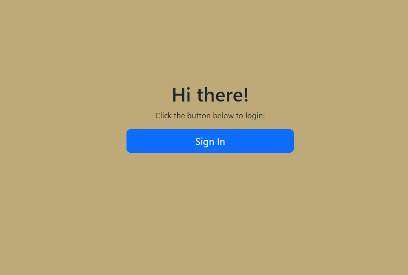
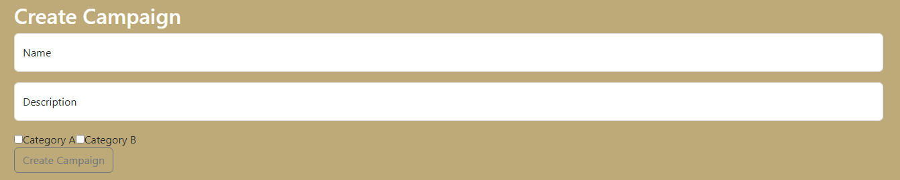

# E22/24 Awareness Campaign Creator Hackathon
The Awareness Campaign Creator Web App is a user-friendly platform designed to empower individuals and organizations to create and manage awareness campaigns effectively. Whether you're advocating for social causes, promoting health initiatives, or supporting environmental efforts, this app provides the tools you need to spread your message and drive change.

## Features
- Intuitive Campaign Builder: Easily create and customize awareness campaigns using a user-friendly interface.
- Categorization: Apply as many categories to your campaigns for a quick reference.

### How to use
1. Sign In or Create an Account: Use your existing account or create a new one to get started.

2. Create a New Campaign: Click on "Create Campaign" to start building your awareness campaign.

3. Select the category your campaign falls under.

4. Share your campaign on social media.

#### How to get setup
1. pull down BE repo 

2. pull down FE repo

3. run visual studio and vsCode

4. run 'dotnet ef database update' in file terminal

5. start https server

6. npm run dev in vsCode

7. sign in!

### WireFrames and ERD 
https://www.figma.com/file/rjyp7PpVr2rQHrzdnP4Y7L/awareness-campaigns?type=design&mode=design&t=HCcmtGS8m8f58Uq5-0

https://dbdiagram.io/d/ERD-practice-63eec5c1296d97641d819c08

#### Deployed site
-
##### Tech and Frameworks
- React js
- Node.js
- PgAdmin4
- Bootstrap
- Swagger
- Entity Framework

###### Contributors
- https://github.com/mark-e-brewer
- https://github.com/Snc1730
- https://github.com/keanacobarde
- https://github.com/GregM1992 
